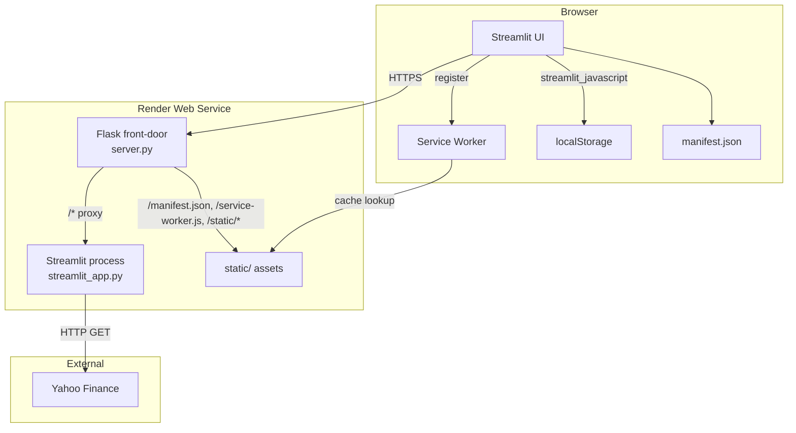
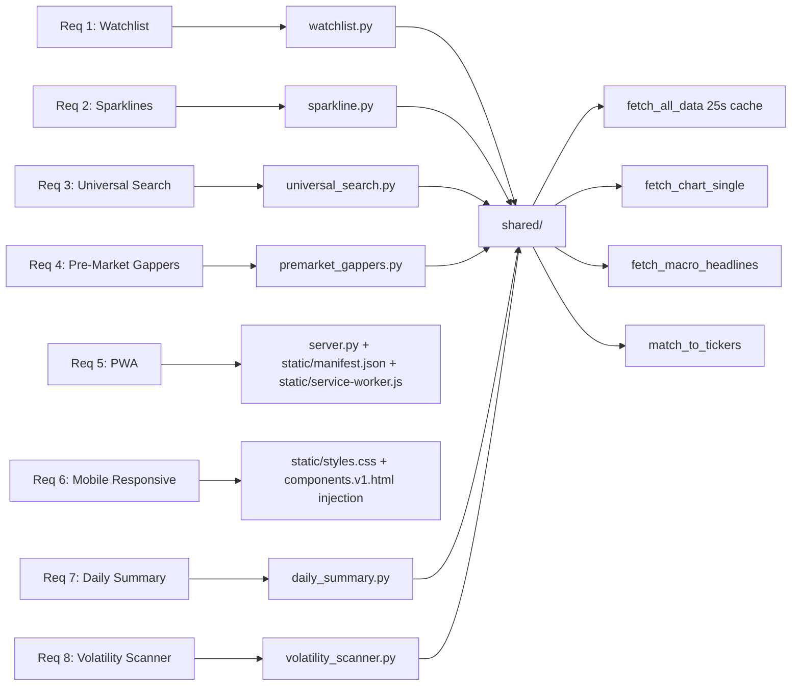
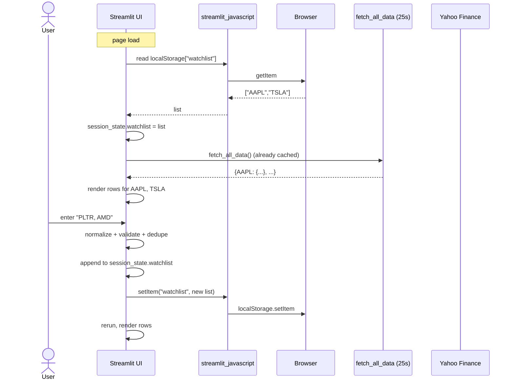
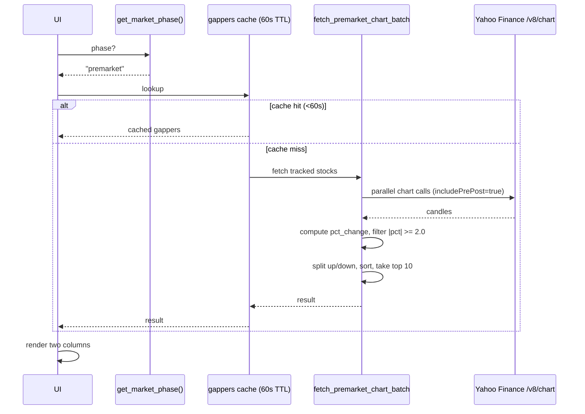
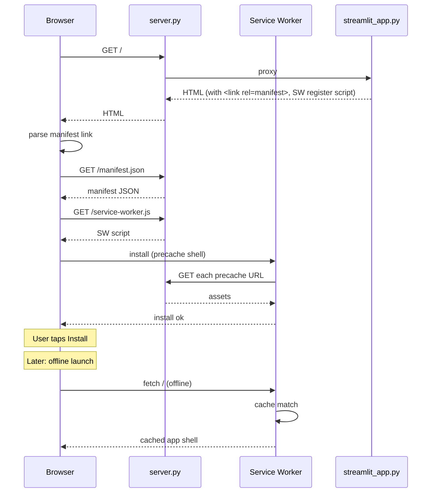
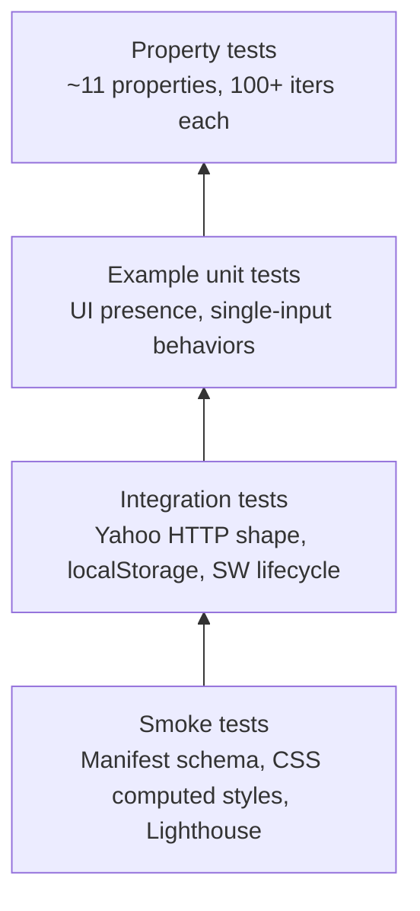

# Design Document

## Overview

The Dashboard Pro Pack adds eight features to the existing Stock Live Dashboard (`streamlit_app.py`, ~1780 lines) without replacing the framework or changing the existing data flow. The pack is split into four domains:

| Domain | Features |
|---|---|
| Trading Insights | Custom Watchlist, Sparkline Mini-Charts |
| Discovery | Universal Stock Search, Pre-Market Gappers |
| Performance | PWA Support, Mobile-First Responsive Tweaks |
| Smart / AI | AI Daily Market Summary, Volatility Scanner |

Design priorities, in order:

1. **Non-invasive integration.** New code is added as self-contained modules behind clear function boundaries. Existing functions (`fetch_all_data`, `generate_insights`, `fetch_macro_headlines`, `match_to_tickers`, `get_market_phase`) are reused rather than refactored.
2. **Render free-tier safe.** No new long-running threads, no paid APIs, no LLM calls. Yahoo Finance endpoints already in use are reused. New caches follow the existing 25 / 60 / 300 / 600-second TTL pattern.
3. **Hybrid Streamlit + asset-shell architecture for PWA.** Streamlit cannot serve `/manifest.json` or `/service-worker.js` from the application root. The PWA shell is delivered through a thin Flask front-door that proxies `/` to the Streamlit process and serves PWA assets directly from `static/`. This keeps Render's existing single-service deployment.
4. **Browser-side persistence for the watchlist.** `streamlit_javascript` reads/writes `localStorage` once per session; Streamlit `session_state` is the working copy. No server-side per-user storage is added.
5. **Property-based correctness for pure logic.** Watchlist normalization, gapper ranking, daily-summary composition, and volatility filtering are pure functions over dictionaries and lists, well suited to property-based tests. UI rendering, PWA offline behavior, and Yahoo HTTP I/O are covered by example, integration, or smoke tests.

### Key research findings

- **Streamlit static file serving.** Streamlit 1.29+ supports `enableStaticServing = true` which serves `/static/*` from a `./static` folder, but it does **not** serve files at the root path (`/manifest.json`, `/service-worker.js`). Browsers require the manifest and service worker to be reachable from the same origin and, for the service worker, with a scope that covers the page that registers it. The accepted Streamlit pattern is to either (a) inject the manifest/SW link via `components.v1.html` and host the assets externally, or (b) front Streamlit with a small reverse proxy that serves the PWA shell files at the root. The existing repository already has `server.py` (Flask) and `static/`, so option (b) is a small extension of what's there.
- **`streamlit_javascript`** ([pip package](https://pypi.org/project/streamlit-javascript/)) executes a JS snippet in the browser and returns the result to Python via Streamlit's component bridge. It is the lightest dependency for `localStorage` round-tripping and integrates with the existing 30-second auto-refresh without extra threads.
- **Yahoo `/v1/finance/search`** returns up to 10 quotes by default with fields `{symbol, shortname, longname, exchange, quoteType}`. Filtering on `quoteType == "EQUITY"` and `exchange ∈ {NMS, NYQ, ASE, BATS, PCX, NCM, NGM}` is the conventional way to limit results to US-listed common stock and ADRs without a paid subscription.
- **Lighthouse 11 PWA "installable" criteria** require: HTTPS (Render provides), valid `manifest.json` with `name`, `short_name`, `start_url`, `display ∈ {standalone, fullscreen, minimal-ui}`, `icons` containing at least a 192x192 and a 512x512 maskable-or-any PNG, and a registered service worker with a `fetch` handler. The minimal SW pattern that satisfies this is a precache-first / network-fallback handler over a short asset list.

Sources informing the design:
- Streamlit static serving discussion: https://docs.streamlit.io/develop/concepts/configuration/options (`enableStaticServing`).
- Web App Manifest spec: https://www.w3.org/TR/appmanifest/.
- Service Workers (W3C): https://www.w3.org/TR/service-workers/.
- Yahoo Finance unofficial API community docs (search/chart endpoints; no licensed redistribution): used for endpoint shape only.

## Architecture

### High-level component diagram



The Flask front-door is the existing `server.py` extended with a small set of routes (`/manifest.json`, `/service-worker.js`, `/static/*`) and a catch-all that reverse-proxies to the local Streamlit process. The PWA shell is therefore served from the same origin as the Streamlit app, which satisfies Lighthouse and the same-origin requirement for service worker registration.

### Feature-to-module mapping



Each new feature lives in its own module under a new `app/` package (or as additional functions inside `streamlit_app.py` if the user prefers a single-file layout). Shared helpers stay at module top of `streamlit_app.py`.

### Request flow: Watchlist load and add



### Request flow: Pre-Market Gappers refresh



### Request flow: PWA install and offline launch



## Components and Interfaces

### 1. Watchlist Manager (`watchlist.py`)

Public interface (pure functions where possible):

```python
# Type aliases
Ticker = str           # uppercased, e.g. "AAPL"
Watchlist = list[Ticker]

WATCHLIST_MAX_LEN = 50
WATCHLIST_TICKER_RE = re.compile(r"^[A-Z][A-Z0-9.\-]{0,9}$")
WATCHLIST_LS_KEY = "stockdash.watchlist.v1"

def parse_input(raw: str) -> list[str]:
    """Split on commas, whitespace, newlines. Returns trimmed uppercase tokens."""

def validate_ticker(t: str) -> bool:
    """True iff t matches WATCHLIST_TICKER_RE."""

def add_tickers(current: Watchlist, raw_input: str) -> tuple[Watchlist, list[str], list[str]]:
    """Returns (new_watchlist, accepted, rejected_with_reason).
    rejected entries carry a reason: 'invalid_format' | 'duplicate' | 'capacity_exceeded'.
    Order of current is preserved; accepted are appended in input order."""

def remove_ticker(current: Watchlist, t: Ticker) -> Watchlist:
    """Returns current with first occurrence of t removed; idempotent if absent."""

def render_watchlist(watchlist: Watchlist, quotes: dict[Ticker, dict]) -> None:
    """Streamlit render. Uses sparkline.render_sparkline for each row.
    For tickers with no quotes entry: status='No data', ticker stays in list."""

# Persistence
def load_from_browser() -> Watchlist:
    """Calls streamlit_javascript('localStorage.getItem(...)'); returns [] on first load."""

def save_to_browser(wl: Watchlist) -> None:
    """Calls streamlit_javascript('localStorage.setItem(...)') with JSON-encoded list."""
```

Streamlit integration: a single `render_watchlist_section()` is called once per page render. It pulls `session_state.watchlist`, hydrates from `localStorage` on first run, renders, and writes back on changes.

### 2. Sparkline Renderer (`sparkline.py`)

```python
SPARKLINE_TTL_S = 600
SPARKLINE_RANGE = "1mo"
SPARKLINE_INTERVAL = "1d"
SPARKLINE_W = 120
SPARKLINE_H = 40
COLOR_POSITIVE = "#10b981"   # tailwind emerald-500, matches existing positive
COLOR_NEGATIVE = "#ef4444"   # tailwind red-500, matches existing negative

@st.cache_data(ttl=SPARKLINE_TTL_S)
def fetch_sparkline_series(ticker: str) -> list[float]:
    """Returns list of valid daily closes (None values stripped). Length 0..30."""

def sparkline_color(series: list[float]) -> str:
    """COLOR_POSITIVE if last >= first, else COLOR_NEGATIVE. Undefined for len<2; caller must check."""

def render_sparkline(ticker: str) -> None:
    """Fetch series. If len<2: render '—'. Otherwise render Plotly figure with no axes/legend
    at width SPARKLINE_W, height SPARKLINE_H, line color from sparkline_color()."""
```

Plotly is the chart library because it is already a Streamlit transitive dependency and renders inline without extra component bundles. The figure is built with `go.Scatter`, `update_xaxes(visible=False)`, `update_yaxes(visible=False)`, `update_layout(margin=dict(l=0,r=0,t=0,b=0), showlegend=False, width=120, height=40)`.

### 3. Universal Search (`universal_search.py`)

```python
US_EXCHANGES = {"NMS", "NYQ", "ASE", "BATS", "PCX", "NCM", "NGM"}
SEARCH_TTL_S = 300
SEARCH_MIN_CHARS = 2
SEARCH_MAX_RESULTS = 10

@st.cache_data(ttl=SEARCH_TTL_S)
def search_tickers(query: str) -> list[dict]:
    """Returns up to SEARCH_MAX_RESULTS Search_Results, each {symbol, name, exchange}.
    Filtered by quoteType=='EQUITY' and exchange in US_EXCHANGES.
    Returns [] for query shorter than SEARCH_MIN_CHARS or on Yahoo error."""

def fetch_detail(ticker: str) -> dict | None:
    """Returns {ticker, price, prev_close, change, pct_change,
                day_low, day_high, w52_low, w52_high, avg_daily_volume}.
    Reuses fetch_chart_single for live; reads meta fields for ranges."""

def render_universal_search() -> None:
    """Renders text input + suggestion list + detail panel + 'Add to Watchlist' button.
    Selection is stored in st.session_state.universal_search_selection."""
```

Failure mode: `search_tickers` and `fetch_detail` swallow exceptions and return `[]` / `None`. The renderer translates these to the two prescribed messages and never clears an existing detail panel on transient errors.

### 4. Pre-Market Gappers (`premarket_gappers.py`)

```python
GAPPERS_TTL_S = 60
GAPPER_THRESHOLD_PCT = 2.0
GAPPER_TOP_N = 10

def compute_gappers(quotes: dict[str, dict]) -> tuple[list[dict], list[dict]]:
    """quotes is the same dict shape produced by fetch_all_data.
    Returns (up, down) where:
      up   = top GAPPER_TOP_N entries with pct_change >= +GAPPER_THRESHOLD_PCT, desc.
      down = top GAPPER_TOP_N entries with pct_change <= -GAPPER_THRESHOLD_PCT, asc.
    Entries are filtered to TRACKED_STOCKS (excludes indices and macro tickers)."""

@st.cache_data(ttl=GAPPERS_TTL_S)
def fetch_premarket_quotes() -> dict[str, dict]:
    """Calls fetch_chart_single in parallel for TRACKED_STOCKS with includePrePost=true.
    Returns dict same shape as fetch_all_data output."""

def render_premarket_gappers() -> None:
    """If get_market_phase() != 'premarket': return without rendering.
    Otherwise render two ranked tables side-by-side (or stacked on mobile)."""
```

The 60-second TTL is enforced by `st.cache_data`. The dashboard's existing 30-second auto-refresh will hit the cache between fetches.

### 5. PWA Shell (`server.py` extension + `static/`)

Files added under `static/`:

- `static/manifest.json` (served at `/manifest.json` via Flask route).
- `static/service-worker.js` (served at `/service-worker.js`).
- `static/icons/icon-192.png`, `static/icons/icon-512.png`, `static/icons/icon-maskable-512.png`.
- `static/pwa-register.js` (small client snippet that calls `navigator.serviceWorker.register('/service-worker.js')`).

Flask routes:

```python
@app.route("/manifest.json")
def manifest():
    return send_from_directory("static", "manifest.json", mimetype="application/manifest+json")

@app.route("/service-worker.js")
def service_worker():
    resp = send_from_directory("static", "service-worker.js", mimetype="application/javascript")
    resp.headers["Service-Worker-Allowed"] = "/"
    resp.headers["Cache-Control"] = "no-cache"
    return resp

@app.route("/static/<path:filename>")
def static_assets(filename):
    return send_from_directory("static", filename)

# Catch-all proxy to the Streamlit process for everything else
```

For the running Streamlit page to register the service worker and link the manifest, `streamlit_app.py` injects a tiny HTML head fragment with `components.v1.html` near the top of the page:

```python
import streamlit.components.v1 as components
components.html("""
<link rel="manifest" href="/manifest.json">
<meta name="theme-color" content="#0f172a">
<script src="/static/pwa-register.js" defer></script>
""", height=0)
```

`pwa-register.js` performs a guarded registration:

```javascript
if ('serviceWorker' in navigator) {
  window.addEventListener('load', () => {
    navigator.serviceWorker.register('/service-worker.js', { scope: '/' });
  });
}
```

Service worker pattern (precache + cache-first for shell, network passthrough for everything else):

```javascript
const CACHE = 'stockdash-shell-v1';   // bumped when shell changes
const SHELL = [
  '/manifest.json',
  '/static/icons/icon-192.png',
  '/static/icons/icon-512.png',
  '/static/icons/icon-maskable-512.png',
  '/static/pwa-register.js'
];

self.addEventListener('install', (e) => {
  e.waitUntil(caches.open(CACHE).then(c => c.addAll(SHELL)));
  self.skipWaiting();
});

self.addEventListener('activate', (e) => {
  e.waitUntil(caches.keys().then(keys =>
    Promise.all(keys.filter(k => k !== CACHE).map(k => caches.delete(k)))));
  self.clients.claim();
});

self.addEventListener('fetch', (e) => {
  const url = new URL(e.request.url);
  if (SHELL.includes(url.pathname)) {
    e.respondWith(caches.match(e.request).then(r => r || fetch(e.request)));
  } else {
    e.respondWith(fetch(e.request));
  }
});
```

The cache name `stockdash-shell-v1` is bumped to `v2`, `v3`, ... when any shell asset changes. The `activate` handler then deletes prior caches.

### 6. Mobile Responsive CSS (`static/styles.css` + injected `<meta viewport>`)

Streamlit emits its own CSS, but `st.markdown(..., unsafe_allow_html=True)` and `components.html` allow injecting overrides. The pack adds:

- A `<meta name="viewport" content="width=device-width, initial-scale=1.0">` tag (injected via `components.html`).
- A `<style>` block (injected once near the top of the page) whose content is loaded from `static/styles.css`. CSS uses `@media (max-width: 767px)` to:
  - Stack the sector heatmap to one column (`.stColumns > div { width: 100% !important; flex-basis: 100% !important; }`).
  - Stack gainers/losers panels vertically.
  - Bump body to `font-size: 14px`, headings to `font-size: 16px`.
  - Constrain tables: `[data-testid="stTable"], [data-testid="stDataFrame"] { max-width: 100%; overflow-x: auto; }`.
  - Enforce `min-height: 44px; min-width: 44px` on `button, [role="button"], a.stButton`.
- For `≥768px`, no overrides apply, preserving existing layout.

### 7. Daily Summary Generator (`daily_summary.py`)

Inputs (all already in cache):

- `quotes: dict` from `fetch_all_data()`.
- `headlines: list[dict]` from `fetch_macro_headlines()`.

```python
SUMMARY_MIN_WORDS = 60
SUMMARY_MAX_WORDS = 200

@dataclass
class SummaryInputs:
    spy: dict | None
    qqq: dict | None
    sector_avg: dict[str, float]
    top_gainers: list[dict]   # length up to 3
    top_losers: list[dict]    # length up to 3
    headlines: list[dict]     # length up to 2

def build_summary_inputs(quotes, headlines) -> SummaryInputs:
    """Pure transform. Filters out indices/macro from sector calc.
    top_gainers = top 3 by pct_change desc; top_losers = top 3 by pct_change asc."""

def compose_summary(inp: SummaryInputs) -> str:
    """Returns paragraph between SUMMARY_MIN_WORDS and SUMMARY_MAX_WORDS words.
    Each sentence is conditional on its inputs being present.
    If inp has no spy and no qqq and no sector_avg and no movers: returns ''."""

def render_daily_summary(quotes, headlines) -> None:
    """Renders the section with paragraph + Regenerate button.
    Auto-trigger on Market_Close: tracks st.session_state.daily_summary_auto_done so
    it fires at most once per session per day."""
```

Auto-generation at 16:00 ET is detected by checking, on every rerun, whether the current ET time is `>= 16:00` and a one-shot flag in `st.session_state` for today's date is unset. If so, generate and set the flag.

Sentence templates (all optional):

1. "SPY closed {sign}{pct}% and QQQ closed {sign}{pct}%."
2. "{Best sector} led with an average of +{pct}%, while {worst sector} lagged at {pct}%."
3. "Top movers up: {T1} {pct}%, {T2} {pct}%, {T3} {pct}%."
4. "Top decliners: {T1} {pct}%, {T2} {pct}%, {T3} {pct}%."
5. "On the news front, {headline 1 title}{; and {headline 2 title}}."

A small word-count clamp (`compose_summary` truncates trailing detail clauses) keeps output within 60–200 words.

### 8. Volatility Scanner (`volatility_scanner.py`)

```python
VOLATILITY_MIN = 1.0
VOLATILITY_MAX = 20.0
VOLATILITY_DEFAULT = 3.0

def scan(quotes: dict[str, dict],
         headlines: list[dict],
         threshold_pct: float) -> list[dict]:
    """Returns list of {ticker, pct_change, price, reason} sorted by abs(pct_change) desc.
    Includes ticker iff abs(pct_change) >= threshold_pct.
    reason = first matching headline title truncated to 100 chars, or '—' if none.
    Excludes INDICES and MACRO_TICKERS."""

def render_volatility_scanner(quotes, headlines) -> None:
    """Renders threshold number_input (1.0..20.0, step 0.5, default 3.0)
    + scan() output as a table."""
```

The scanner reuses `quotes = fetch_all_data()` and `headlines = fetch_macro_headlines()` — no new HTTP calls. Headline matching reuses the existing `match_to_tickers()`.

## Data Models

### Quote (existing, reused everywhere)

Produced by `fetch_all_data()` and `fetch_chart_single()`:

```python
Quote = TypedDict("Quote", {
    "ticker": str,
    "price": float,
    "prev_close": float,
    "change": float,
    "pct_change": float,
    "volume": int,
    "sector": str,
    "sectors": list[str],
    "is_premarket": bool,
})
```

### Watchlist persistence shape

`localStorage["stockdash.watchlist.v1"]`:

```json
{"version": 1, "tickers": ["AAPL", "TSLA", "PLTR"]}
```

A versioned wrapper allows future migrations without losing user data.

### Sparkline series (cache value)

```python
SparklineSeries = list[float]   # 0..30 daily closes, None values stripped
```

### Search result

```python
SearchResult = TypedDict("SearchResult", {
    "symbol": str,
    "name": str,         # shortname if present, else longname, else symbol
    "exchange": str,     # one of US_EXCHANGES
})
```

### Search detail panel

```python
SearchDetail = TypedDict("SearchDetail", {
    "ticker": str,
    "price": float,
    "prev_close": float,
    "change": float,
    "pct_change": float,
    "day_low": float | None,
    "day_high": float | None,
    "w52_low": float | None,
    "w52_high": float | None,
    "avg_daily_volume": int | None,
})
```

### Gapper entry

```python
GapperEntry = TypedDict("GapperEntry", {
    "ticker": str,
    "price": float,
    "pct_change": float,
    "volume": int,
})
```

### Daily Summary inputs (already shown above as `SummaryInputs` dataclass)

### Volatility scan entry

```python
VolatilityEntry = TypedDict("VolatilityEntry", {
    "ticker": str,
    "pct_change": float,
    "price": float,
    "reason": str,    # headline title truncated to 100 chars, or "—"
})
```

### Headline (existing, reused)

Produced by `fetch_macro_headlines()`:

```python
Headline = TypedDict("Headline", {
    "title": str,
    "source": str,
    "pub": str,        # ISO timestamp string
})
```

### Manifest (`static/manifest.json`)

```json
{
  "name": "Stock Live Dashboard",
  "short_name": "StockDash",
  "start_url": "/",
  "scope": "/",
  "display": "standalone",
  "background_color": "#0f172a",
  "theme_color": "#0f172a",
  "icons": [
    {"src": "/static/icons/icon-192.png", "sizes": "192x192", "type": "image/png"},
    {"src": "/static/icons/icon-512.png", "sizes": "512x512", "type": "image/png"},
    {"src": "/static/icons/icon-maskable-512.png", "sizes": "512x512", "type": "image/png", "purpose": "maskable"}
  ]
}
```

## Algorithm pseudocode (key flows)

### Watchlist add (Req 1.3, 1.9, 1.10)

```
function add_tickers(current, raw_input):
    accepted = []
    rejected = []
    seen = set(current)                    # membership check is O(1)
    for tok in parse_input(raw_input):     # split on , whitespace, newline; uppercase
        if not validate_ticker(tok):
            rejected.append((tok, "invalid_format"))
            continue
        if tok in seen:
            rejected.append((tok, "duplicate"))
            continue
        if len(current) + len(accepted) >= WATCHLIST_MAX_LEN:
            rejected.append((tok, "capacity_exceeded"))
            continue
        accepted.append(tok)
        seen.add(tok)
    return current + accepted, accepted, rejected
```

### Pre-market gapper computation (Req 4.3–4.5)

```
function compute_gappers(quotes):
    candidates = [q for q in quotes.values()
                  if q.ticker in TRACKED_STOCKS                  # not index/macro
                  and q.prev_close > 0
                  and q.price is not None]
    up   = [q for q in candidates if q.pct_change >=  GAPPER_THRESHOLD_PCT]
    down = [q for q in candidates if q.pct_change <= -GAPPER_THRESHOLD_PCT]
    up.sort(key=pct_change, reverse=True)
    down.sort(key=pct_change)               # ascending => most negative first
    return up[:GAPPER_TOP_N], down[:GAPPER_TOP_N]
```

### Daily summary composition (Req 7.5–7.7)

```
function compose_summary(inp):
    parts = []
    if inp.spy or inp.qqq:
        parts.append(index_sentence(inp.spy, inp.qqq))
    if inp.sector_avg:
        best, worst = top_bottom(inp.sector_avg)
        parts.append(sector_sentence(best, worst))
    if inp.top_gainers:
        parts.append(gainers_sentence(inp.top_gainers))
    if inp.top_losers:
        parts.append(losers_sentence(inp.top_losers))
    if inp.headlines:
        parts.append(headlines_sentence(inp.headlines[:2]))
    if not parts:
        return ""
    text = " ".join(parts)
    text = pad_if_short(text, SUMMARY_MIN_WORDS)        # appends a generic context clause
    text = trim_if_long(text, SUMMARY_MAX_WORDS)        # drops trailing optional clauses
    return text
```

### Volatility scan (Req 8.2–8.6)

```
function scan(quotes, headlines, threshold):
    rows = []
    for q in quotes.values():
        if q.ticker in INDICES or q.ticker in MACRO_TICKERS:
            continue
        if abs(q.pct_change) < threshold:
            continue
        reason = "—"
        for h in headlines:                          # ranked order from fetch_macro_headlines
            if q.ticker in match_to_tickers(h.title, [q.ticker]):
                reason = h.title[:100]
                break
        rows.append({ticker: q.ticker, pct_change: q.pct_change,
                     price: q.price, reason: reason})
    rows.sort(key=lambda r: abs(r.pct_change), reverse=True)
    return rows
```


## Correctness Properties

*A property is a characteristic or behavior that should hold true across all valid executions of a system — essentially, a formal statement about what the system should do. Properties serve as the bridge between human-readable specifications and machine-verifiable correctness guarantees.*

PBT applies cleanly to the pure logic in this pack: watchlist normalization, sparkline color polarity, search-result filtering, gapper ranking, daily-summary composition, and volatility scanning. PBT does **not** apply to PWA service-worker behavior, mobile CSS rules, or auto-refresh wiring; those are covered by integration and smoke tests in the Testing Strategy section.

### Property 1: Watchlist add preserves invariants across arbitrary inputs

*For any* current watchlist `wl` (length 0..50, all entries valid uppercase tickers, all distinct) and *for any* raw user input string `raw`, let `(new_wl, accepted, rejected) = add_tickers(wl, raw)`. The following must all hold:

- `new_wl` starts with `wl` as its prefix (existing entries are never reordered or dropped).
- `new_wl` contains no duplicates.
- `len(new_wl) <= 50`.
- Every appended token (those in `new_wl` but not in `wl`) satisfies `validate_ticker`, equals its uppercased trimmed form, and equals an element of `accepted`.
- Every token in `rejected` carries one of three reasons (`invalid_format`, `duplicate`, `capacity_exceeded`) that is consistent with the state of the list at the moment that token was processed.
- The set `accepted ∪ {tok for tok, _ in rejected}` equals the set of tokens produced by `parse_input(raw)`.

**Validates: Requirements 1.2, 1.3, 1.9, 1.10**

### Property 2: validate_ticker equals the regex semantics

*For any* string `s`, `validate_ticker(s)` returns true if and only if `s` matches the regular expression `^[A-Z][A-Z0-9.\-]{0,9}$`.

**Validates: Requirements 1.9**

### Property 3: Watchlist remove is the first-occurrence delete

*For any* watchlist `wl` and *for any* ticker `t`, `remove_ticker(wl, t)` equals `wl` with the first occurrence of `t` removed if `t in wl`, else equals `wl` unchanged. Length decreases by exactly one if `t in wl`, by zero otherwise.

**Validates: Requirements 1.4**

### Property 4: Watchlist render contract over present and missing quotes

*For any* watchlist `wl` and *for any* mapping `quotes` whose keys are an arbitrary subset of `wl`, the rendered output of `render_watchlist(wl, quotes)` (a) contains every ticker in `wl` exactly once in `wl`'s order, (b) for tickers in `quotes` displays the ticker symbol, formatted price, formatted absolute change, and formatted percent change, and (c) for tickers not in `quotes` displays the ticker symbol followed by the string "No data". The watchlist `wl` is unchanged after rendering.

**Validates: Requirements 1.7, 1.8**

### Property 5: Sparkline color reflects series direction

*For any* sparkline series `s` of length at least 2 with finite numeric values, `sparkline_color(s) == COLOR_POSITIVE` if and only if `s[-1] >= s[0]`, and `sparkline_color(s) == COLOR_NEGATIVE` if and only if `s[-1] < s[0]`.

**Validates: Requirements 2.5, 2.6**

### Property 6: Sparkline placeholder for insufficient data

*For any* sparkline series `s` containing fewer than 2 valid numeric closes (after stripping `None` values), `render_sparkline_for_series(s)` produces the dash placeholder `"—"` and does not produce a chart.

**Validates: Requirements 2.8**

### Property 7: Universal search results respect query, filter, and shape

*For any* query string `q` and *for any* mock Yahoo response payload, `search_tickers(q)` returns a list of length at most 10 such that:

- If `len(q) < 2`, the list is empty.
- Every returned entry has `quoteType == "EQUITY"` in its source row and `exchange ∈ {NMS, NYQ, ASE, BATS, PCX, NCM, NGM}`.
- Every returned entry has the keys `symbol`, `name`, `exchange`, where `name` is non-empty.
- The rendered suggestion string for each entry contains both `entry.symbol` and `entry.name`.

Additionally, *for any* `SearchDetail` dict produced by `fetch_detail`, the rendered detail panel contains the ticker symbol, latest price, absolute change, percent change, previous close, day's range, 52-week range, and average daily volume whenever those fields are present in the dict.

**Validates: Requirements 3.2, 3.3, 3.4, 3.6**

### Property 8: Pre-market gappers partition, sort, and cap

*For any* `quotes: dict[str, Quote]`, let `(up, down) = compute_gappers(quotes)` and let `tracked = {q for q in quotes.values() if q.ticker not in INDICES ∪ MACRO_TICKERS}`. The following must all hold:

- Every entry in `up` is drawn from `tracked` and has `pct_change >= 2.0`.
- Every entry in `down` is drawn from `tracked` and has `pct_change <= -2.0`.
- `up` and `down` are disjoint.
- `up` is sorted by `pct_change` descending; `down` is sorted by `pct_change` ascending.
- `len(up) <= 10` and `len(down) <= 10`.
- `up` contains exactly the top 10 (or fewer) of `{q ∈ tracked : q.pct_change >= 2.0}` ordered by `pct_change` desc, and `down` is its mirror for the negative side.
- Each entry exposes `ticker`, `price`, `pct_change`, and `volume`.

**Validates: Requirements 4.3, 4.4, 4.5, 4.6**

### Property 9: Daily summary content, length, and omission rules

*For any* `SummaryInputs` `inp` with at least one of {`spy`, `qqq`, `sector_avg`, `top_gainers`, `top_losers`, `headlines`} non-empty, let `text = compose_summary(inp)`. The following must all hold:

- The word count of `text` is between 60 and 200 inclusive.
- If `inp.spy` is present, `text` contains the SPY percent change.
- If `inp.qqq` is present, `text` contains the QQQ percent change.
- If `inp.sector_avg` is non-empty, `text` mentions the strongest sector and the weakest sector and their averages.
- For each present `top_gainers[i]` (i in 0..2), `text` contains that ticker symbol.
- For each present `top_losers[i]` (i in 0..2), `text` contains that ticker symbol.
- `text` references at most 2 headline titles drawn from `inp.headlines`.
- `text` does not reference any field that is absent from `inp` (no placeholder strings, no `None`, no empty parentheses).

For the empty-inputs case, `compose_summary(empty_inputs)` returns the empty string and the renderer surfaces the fallback message `"Summary unavailable — market data not loaded yet"`.

For the auto-trigger predicate `should_auto_generate(now_et, last_run_date)`, *for any* sequence of clock samples crossing 16:00 ET on a trading weekday, the predicate returns `True` exactly once per (session, trading day).

**Validates: Requirements 7.3, 7.5, 7.6, 7.7, 7.8**

### Property 10: Volatility scan filter and sort

*For any* `quotes: dict[str, Quote]`, *for any* `headlines: list[Headline]`, and *for any* `threshold ∈ [1.0, 20.0]`, let `rows = scan(quotes, headlines, threshold)`. The following must all hold:

- The set `{r.ticker for r in rows}` equals `{q.ticker for q in quotes.values() if q.ticker not in INDICES ∪ MACRO_TICKERS and abs(q.pct_change) >= threshold}`.
- `rows` is sorted by `abs(r.pct_change)` descending.
- Each row exposes `ticker`, signed `pct_change`, `price`, and `reason`.
- `scan` makes zero outbound HTTP calls (verifiable by mocking `requests.get`).

**Validates: Requirements 8.2, 8.3, 8.4, 8.9**

### Property 11: Volatility scan reason resolution

*For any* `quotes` and *for any* ranked headline list `headlines`, the `reason` field of every row in `scan(quotes, headlines, threshold)` is either:

- The first headline title in `headlines` order such that `match_to_tickers(title, [row.ticker])` is non-empty, truncated to 100 characters; or
- The string `"—"` when no headline matches that ticker.

**Validates: Requirements 8.5, 8.6**

## Error Handling

| Failure | Detection | Behavior |
|---|---|---|
| Yahoo `/v8/finance/chart` HTTP error or timeout (sparkline) | `requests.RequestException`, non-200, JSON parse error | `fetch_sparkline_series` returns `[]`. Renderer falls through to placeholder `"—"`. No exception propagates. |
| Yahoo `/v1/finance/search` HTTP error or timeout (universal search) | `requests.RequestException`, non-200, JSON parse error | `search_tickers` returns `[]`. Renderer shows `"Search temporarily unavailable"`. Any previously displayed detail panel held in `st.session_state.universal_search_selection` is preserved unchanged (Req 3.8). |
| Yahoo returns zero matches for a search query | `len(filtered_results) == 0` | Renderer shows `"No US-listed equities found"` (Req 3.7). |
| Pre-market chart fetch fails for some tickers | `fetch_chart_single` returns `None` | Those tickers are simply absent from the gapper input set. Lists may shorten or be empty; if empty, render `"No qualifying gappers"` (Req 4.8). |
| Watchlist contains a ticker that returns no Yahoo data | `quotes.get(ticker) is None` | Render the ticker with status `"No data"` and keep it in the watchlist (Req 1.8). |
| User submits invalid ticker format | `validate_ticker` returns False | Return rejected with reason `invalid_format`. Watchlist unchanged for that token; inline error names the rejected symbol (Req 1.9). |
| User attempts to exceed 50 tickers | Capacity check during `add_tickers` | Excess tokens rejected with reason `capacity_exceeded`. Watchlist truncated at 50 (Req 1.10). |
| `localStorage` not available (private window, blocked) | `streamlit_javascript` returns `None` | `load_from_browser` returns `[]`; watchlist starts empty for that session. `save_to_browser` swallows any error. No crash. |
| Service worker registration fails | Browser exception in `register()` | Caught in `pwa-register.js` with `.catch(console.warn)`. Page continues to function without offline support. |
| Daily summary called when no data is cached | All inputs empty | `compose_summary` returns `""`; renderer shows the fallback message (Req 7.8). |
| Volatility scan called with stale or missing macro headlines | `headlines is None` or empty | Every entry's `reason` becomes `"—"`. Scan still functions. |
| Yahoo rate limit or IP block | HTTP 429 / 403 | Caches retain last good values per their TTLs; UI continues showing last known data with the existing `last_updated` caption. No retry storm: the existing 25-second `st.cache_data` TTL acts as backoff. |

Defensive patterns used consistently:

- All new fetch functions wrap their HTTP calls in `try/except` and return a sentinel (`[]`, `None`, or empty dict) on any failure, matching the existing module's style.
- All new render functions assume their inputs may be empty and short-circuit to the prescribed fallback message.
- No new background threads. Every cache is a `st.cache_data`-decorated function that runs lazily on the request thread.

## Testing Strategy

### Test pyramid



### Frameworks and libraries

- **pytest** as the test runner.
- **Hypothesis** for property-based tests (matches Python ecosystem; integrates cleanly with pytest).
- **requests-mock** or **responses** for stubbing Yahoo HTTP endpoints.
- **streamlit.testing.v1.AppTest** for Streamlit-level render assertions where feasible.
- **Playwright** (or **Selenium** if a lighter setup is preferred) for browser-side checks: localStorage round-trip, service worker install/cache, mobile-viewport CSS, and Lighthouse audit. Playwright is recommended because it has first-class service-worker and offline-mode test APIs.
- **Lighthouse CI** for the PWA installability audit (Req 5.8).

### Property tests

One property-based test per design property, all 11 properties from the Correctness Properties section. Each test runs Hypothesis with a minimum of 100 generated examples and is tagged with a docstring of the form:

```
"""Feature: dashboard-pro-pack, Property {n}: {one-line description}"""
```

Example test scaffold for Property 8 (gappers):

```python
from hypothesis import given, settings, strategies as st as hst

@settings(max_examples=200)
@given(quotes=hst.dictionaries(
    keys=hst.sampled_from(list(TRACKED_STOCKS) + ["SPY", "^VIX"]),
    values=hst.fixed_dictionaries({
        "ticker": hst.text(),                              # overridden below
        "price": hst.floats(min_value=0.01, max_value=1e6),
        "prev_close": hst.floats(min_value=0.01, max_value=1e6),
        "change": hst.floats(),
        "pct_change": hst.floats(min_value=-100, max_value=500),
        "volume": hst.integers(min_value=0, max_value=10**10),
        "sector": hst.sampled_from(list(STOCKS.keys()) + ["Index"]),
        "sectors": hst.lists(hst.sampled_from(list(STOCKS.keys())), max_size=3),
        "is_premarket": hst.booleans(),
    }),
    max_size=80,
))
def test_compute_gappers_invariants(quotes):
    """Feature: dashboard-pro-pack, Property 8: pre-market gappers partition, sort, and cap"""
    # Coerce 'ticker' field to match the dict key
    quotes = {k: {**v, "ticker": k} for k, v in quotes.items()}
    up, down = compute_gappers(quotes)

    tracked = {q["ticker"] for q in quotes.values()
               if q["ticker"] not in INDICES and q["ticker"] not in MACRO_TICKERS}

    for q in up:
        assert q["ticker"] in tracked
        assert q["pct_change"] >= 2.0
    for q in down:
        assert q["ticker"] in tracked
        assert q["pct_change"] <= -2.0

    assert {q["ticker"] for q in up}.isdisjoint({q["ticker"] for q in down})
    assert len(up) <= 10 and len(down) <= 10
    assert all(up[i]["pct_change"] >= up[i+1]["pct_change"]   for i in range(len(up)-1))
    assert all(down[i]["pct_change"] <= down[i+1]["pct_change"] for i in range(len(down)-1))
```

### Example and edge-case tests

These complement the property tests with concrete, fast checks:

- Watchlist UI presence and basic add/remove flows.
- Sparkline figure shape (axes hidden, legend hidden, dimensions ≤ 120×40).
- Universal search empty-state and error-state messages (Req 3.7, 3.8).
- Pre-market gappers empty-state message (Req 4.8).
- Daily Summary empty-data fallback (Req 7.8).
- Volatility Scanner empty-result message (Req 8.8).
- Universal search "Add to Watchlist" wiring (Req 3.9).

### Integration tests

- **Yahoo HTTP shape (mocked):** for each new fetch function, assert URL, query parameters, headers, and timeout via `responses`.
- **Watchlist round-trip:** Playwright test — open the app, add `AAPL`, reload page, assert the row is rendered.
- **Service worker lifecycle:** Playwright test — load the page, wait for SW activation, assert `caches.has('stockdash-shell-v1')`. Then change the SW source, reload, and assert the prior cache is deleted on activate (Req 5.7).
- **Offline app shell:** Playwright test — install SW, go offline, reload, assert cached icons and `manifest.json` are served from the cache (Req 5.5).
- **Network passthrough for non-shell requests:** Playwright test — assert that requests to Streamlit endpoints are not served from the SW cache (Req 5.6).

### Smoke tests

- **Manifest schema:** GET `/manifest.json`, validate against a Pydantic or JSON-schema spec covering Req 5.1.
- **Page tags:** GET `/`, parse HTML, assert `<link rel="manifest">`, `<meta name="theme-color">`, and `<meta name="viewport">` are present (Req 5.2, 6.7).
- **Mobile CSS:** Playwright with viewport `375x812`, navigate to page, assert computed styles for sector tile width, gainers/losers stacking, font sizes, table overflow, and button hit areas (Req 6.1–6.6).
- **Cache TTLs:** Inspect `st.cache_data` decorator arguments on `fetch_sparkline_series` (≥600s), `search_tickers` (≥300s), `fetch_premarket_quotes` (≤60s).
- **Lighthouse PWA audit:** run Lighthouse CI in pre-deploy step, fail if `installable-manifest` audit fails (Req 5.8).
- **No external HTTP from `scan` and `compose_summary`:** patch `requests.get` to raise; call functions; assert no calls (Req 7.4, 8.9).

### Property test configuration

- All Hypothesis tests use `@settings(max_examples=200)` (above the required minimum of 100) for headroom.
- Each property test is tagged with a one-line docstring `Feature: dashboard-pro-pack, Property {n}: {text}` for traceability back to this design.
- Property generators reuse a small library of strategies (`tickers`, `quotes`, `headlines`, `summary_inputs`) to keep tests readable and consistent.
- Yahoo HTTP is never called from property tests; pure functions only. Functions that do HTTP (e.g., `fetch_sparkline_series`) are tested via integration tests, while their pure transformations (`sparkline_color`, `compute_gappers`, `scan`, `compose_summary`, `add_tickers`, `validate_ticker`, `remove_ticker`) carry the property tests.

